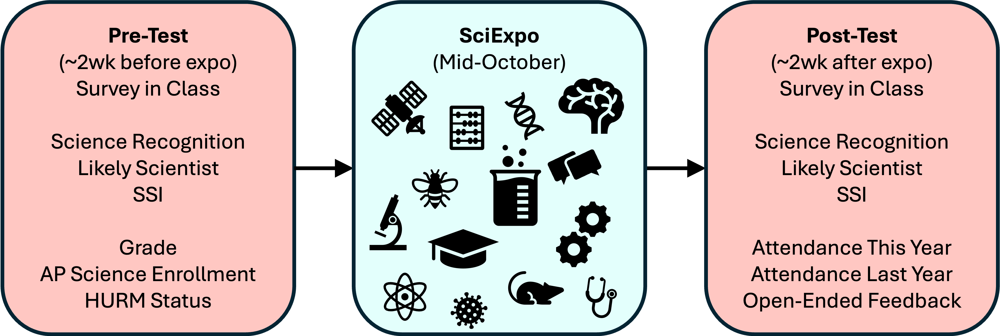

# Design

This study was conducted at Madison East High School in Madison, WI, USA.

Students were asked to complete a survey before and after the 2025 edition of a scientific outreach event (the [science expo](https://alaneuro.weebly.com/science-expo.html)). The science expo took place on October 16^th^, 2025. The survey data were collected in class about 2 weeks before and after the expo, specifically on October 3^rd^ (pre-test) and October 28^th^ (post-test).

# Measures

The students answered the following survey questions on a 5 point Liker scale, where the scale went from "*0-Not at all*" to "*5-Extremely*". Measures 1 and 2 are *ad hoc* questions developed for the purpose of this study. Measures 2 to 6 are subscales from the Students’ Science Identity questionnaire (SSI - See Jiang et al., 2024). To keep the questionnaire as short as possible, we only kept a subset of the items in the scale, where the kept items are in bold. Items were removed based on the loading on their respective constructs as presented in Jiang et al. (2024) and Chen & Wei (2022).

1.  Likely Scientist
    -   ***How likely do you think that someone like you could become a scientist?***
2.  Science Representation :
    -   ***How much do you see yourself represented in the scientific community?***
3.  SSI Competence
    1.  ***I think I am good at science.***
    2.  *I can understand scientific laws and principles well.*
    3.  ***I am able to use science to explain the nature phenomena in daily life.***
    4.  *I believe I can learn a lot of knowledge in science classes.*
    5.  ***I believe I will do well in science.***
    6.  ***I believe I can learn even the hardest parts of scientific knowledge if I try.***
4.  SSI Interest
    1.  ***I will learn more about science knowledge through a variety of sources.***
    2.  ***I like to participate in various scientific activities.***
    3.  ***I think the science knowledge taught in my classes is important in real world.***
    4.  *I like the science equipment in my science classes.*
    5.  ***I like to attend classes that are related to science.***
    6.  ***I am interested in careers that are related to science.***
    7.  *I plan to pursue science careers in the future.*
    8.  *I would feel comfortable talking to people who work in science careers.*
5.  SSI Performance
    1.  ***I think I did well in science classes.***
    2.  ***I am able to get a good grade in science subjects.***
    3.  *I am able to complete my science homework.*
    4.  ***I am proficient in using tools and operating apparatus in experiments.***
6.  SSI Recognition
    1.  ***I think myself as a science person.***
    2.  ***My classmates recognize me as a science person.***
    3.  ***My science teachers recognize me as a science person.***
    4.  ***My family and friends recognize me as a science person.***

In addition, we collected the following measures at pre-test

-   **Current grade (9^th^, 10^th^, 11^th^, or 12^th^)**
-   **AP science class enrollment**
-   ***Are you a part of a group that has often been underrepresented, included but not limited to factors like your race, ethnicity, religion, gender, sexual orientation, income, ability, where you were born, or being the first in your family to attend college?***

and at post-test

-   **This Year's Science Expo Attendance**
-   **Previous Year's Science Expo Attendance**
-   ***After attending the Science Expo, how has seeing yourself being represented, or not represented, in the scientific community influenced your perception or feelings about your own place in science? \[Open ended question\]***
-   ***What aspects of the Science Expo did you find most valuable? \[Open ended question\]***
-   ***What aspects of the Expo would you improve and how? \[Open ended question\]***
-   ***Any other comments or reflections you want to share with the organizers? \[Open ended question\]***

# Bibliography

Chen, S., & Wei, B. (2022). Development and Validation of an Instrument to Measure High School Students’ Science Identity in Science Learning. *Research in Science Education*, *52*(1), 111–126. <https://doi.org/10.1007/s11165-020-09932-y>

Jiang, Z., Wei, B., Chen, S., & Tan, L. (2024). Examining the Formation of High School Students’ Science Identity: The Role of STEM-PBL Experiences. *Science & Education*, *33*(1), 135–157. <https://doi.org/10.1007/s11191-022-00388-2>
